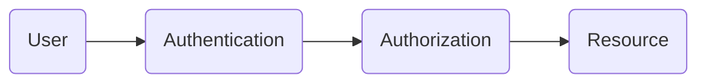

# Learning GraphQL programmatically

This page summarizes everything you should need to know about GraphQL in theory. In addition there are also practical examples.

## What is GraphQL?
Graphql is a query language for consuming data from an API but also a runtime for providing data to those API queries. It was developed by Facebook in 2012 and open sourced in 2015. Facebook wanted to define a new way for making requests to the server since there apps were very slow because of to many requests. They had the problem of overfetching and underfetching data (see below).

### What is the advantage of GraphQL?
- it provides complete and understandable description of the data in your API
-  the client can ask for what he needs
- easier evolving of a API over time
- enables powerful developer tools

### Why do we need GraphQL when there is REST?
- GraphQL prevents you from *overfetching* which means you just get the data you need (REST does not prevents you from *overfetching* because there is a fixed response schema)
- With GraphQL you can get many resources with just one request and so avoids *underfetching* (with REST you probably need to make more requests to get the same data or you have to define a batch route) 
- Defined schemas which fully represents your API (=typed system) (for REST when you use the OpenAPI specification you also provide typed systems)
- Evolve your API without versions
- You can bring GraphQL easily into your system without changing your data or business logic since GraphQL provides the api layer

## GraphQL in action: Define your first GraphQL API

### 1. Define a schema
First we define a ``server.js`` file:

```js
const typeDefs = `#graphql
    schema {
        query: Query
    }

    type Query {
        greeting: String
    }
`
```
<details>
<summary>Colapse here to see the full server.js</summary>

```js
import { ApolloServer } from '@apollo/server';
import { startStandaloneServer} from '@apollo/server/standalone';

const typeDefs = `#graphql
    schema {
        query: Query
    }

    type Query {
        greeting: String
    }
`

const resolvers = {
    greeting: () => 'Hello World'
}

const server = new ApolloServer({ typeDefs, resolvers });
const info = await startStandaloneServer(server, { listen: {port: 9000}});
console.log(`Server is running at $(info.url)`);

```
</details>

In this example ``typeDefs`` represents the interface of your API and declares which fields a client can request. It use the schema definition language which was defined to create a graphql schema.

> [!TIP]  
> You do not have to explicitly define the schema in this case because like this it is defined by default


### 2. Define a resolver function
In addition you also need to a asign a value to your defined fields through defining a ``resolvers`` function:
```js
const resolvers = {
    greeting: () => 'Hello World'
}
```

### 3. Install the dependencies 
Now we want to expose our API over HTTP, the most common way to provide GraphQL APIs to the client. To do so we use a libary called ``Apollo Server`` which is a popular GraphQL implementation for javascript.

First we define a ``package.json``
```json
{
    "name": "my-first-graphql-api",
    "private": true,
    "type": "module",
}
```
Then in your terminal run:
``>>> npm install @apollo/server graphql``

This will install two packages:
- apollo/server which will expose your API via HTTP
- graphql which will provide core graphql functionality

### 4. Define Apollo server
```js
import { ApolloServer } from '@apollo/server';
import { startStandaloneServer} from '@apollo/server/standalone';

# schema 
# resolver

const server = new ApolloServer({ typeDefs, resolvers });
const info = await startStandaloneServer(server, { listen: {port: 9000}});
console.log(`Server is running at $(info.url)`);

```
> [!TIP]  
> Using so called Backtick delimited strings aka template literal you can insert an expression into your string

> [!TIP]  
> You could use object destructuring to unpack properties of an object. For example you could write ``const { url }`` instead of ``const info`` and then use it directly in the console log instead of ``info.url``

### 5. Run the server
To provide your first GraphQL API over HTTP run apollo server:

``>>> node server.js``

It will open a page in the browser which is called Apollo Sandbox. You can use this tool to make GraphQL queries. Sandbox is a web based GraphQL client which provides you the oportunity to call any GraphQL API.

## Implement the clients code
TBD

## Apollo Server with Express, Custom Object Types, Arrays and Nullability
TBD

## Handling errors
When the server encounters errors to handle the query it sends back a list of errors inside the response (``"data": [], "errors": [...]``) that have occured while the query was executed. Inside this error array you get information about each error containing an error code plus the stacktrace.

There are different built-in errors defined by apollo you can handle (https://www.apollographql.com/docs/apollo-server/data/errors#built-in-error-codes). 

But in addition you can also create custom errors like so:

```js
import { GraphQLError } from 'graphql';

throw new GraphQLError(message, {
  extensions: { code: 'YOUR_ERROR_CODE', myCustomExtensions },
});
```
> [!TIP]  
> You can provide abitrary fields to the error's extension object to provide useful information to the client

## Mutations
Until now we were only able to read data from our GraphQL API. But in real world scenarios we also want to give the client the ability to send new data to the GraphQL API so that the server can save this data inside the database.

In GraphQL we can achieve this by defining ***mutations***. 

Let's implement a mutation inside our ``graphql.schema``:
```js
type Mutation {
  createJob(title: String!, description: String): Job
}
```
We introduce a new object type called ``Mutation``. Until now we have just used the object type ``Query`` to read data from our API. In order to write data to the API we now need to define an object type ``Mutation``.

Inside the ``Mutation`` you pass it the ``createJob`` operation which gets the arguments ``title`` and ``description``. You can see that the ``title`` is mandatory by looking at the type hint ``String!`` and the ``description`` is optional ``String``. It follows the type definition of the object type ``Job``.

As always after defining the schema we have to implement the resolver function.

Let's jump into your ``resolvers.js``:

```js
export const resolvers = {
  # Query

  Mutation: {
    createJob: (_root, { title, description }) => {
      const companyId = 'FjcJCHJALA4i'
      const job = createJob({companyId, title, description})
      return job
    }
  },

  # Company

  # Job
}
```

> [!NOTE]  
> For testing the mutation we hardcoded the ``companyId = 'FjcJCHJALA4i'``.
### Test the API

And that's it. Now lets check in the Apollo Sandbox:  
Start your apollo server by running ``node server.js`` inside your ``/server`` folder and open ``localhost:9000/graphql`` in your browser.

> [!NOTE]  
> At the beginning you have to install the dependencies by running ``npm install`` to make the service run succesfully.

Now define the following mutation to define a new custom object tpye ``Job`` item:
```graphql
mutation {
  createJob(title: "Devops", description: "a small description") {
    id
    date
    title
    company {
      id
      name
    }
  }
}
```
The response should look as follow:
```json
{
  "data": {
    "createJob": {
      "id": "WfNhdAUShTvU",
      "date": "2024-02-04",
      "title": "Devops",
      "company": {
        "id": "FjcJCHJALA4i",
        "name": "Facegle"
      }
    }
  }
}
```

A more common way is to define your args in the variable section:

<details>
<summary>Collapse here to see the full alternative</summary>

Define the mutation like this:
```graphql
mutation CreateJob($title: String!, $description: String) {
  createJob(title: $title, description: $description) {
    id
    date
    title
    company {
      id
      name
    }
  }
}
```
And then you can implement the variables like:
```json
{
  "title": "DevOps",
  "description": "A small description"
}
```
> [!CAUTION]  
> This way you can separte the definition of your arguments from the mutation but you have to write huge amount of boilderplate code and it will get even worse with more and more arguments.
</details>

### Input types
To overcome the drawback of having to many variables while using the variables section there is a server side fix.

Rewrite your ``schema.graphql`` that it looks like as followed:
```graphql
type Mutation {
  createJob(input: CreateJobInput!): Job
}

input CreateJobInput {
  title: String!
  description: String
}
```
We defined a new custom object type ``CreateJobInput`` which is of type ``input``. It is used as an argument inside the ``createJob`` mutation.

> [!NOTE]  
> ``type`` vs. ``input``: object types like ``type`` are **output types** which respresent data the server sends back to the client. While on the other side the ``input`` type is an object that is send by the client and can only be used as an argument.

Besides that you also have to make a small adaption inside your ``resolver.js`` file:  
``createJob: (_root, { input: {title, description }})``  

The whole mutation then looks like:
```js
  Mutation: {
    createJob: (_root, { input: {title, description }}) == => {
      const companyId = 'FjcJCHJALA4i'
      const job = createJob({companyId, title, description})
      return job
    }
  },
```
Rerun your server and jump back to the apollo Sandbox and adapt your muatation:
```graphql
mutation CreateJob($input: CreateJobInput!) {
  createJob(input: $input) {
    id
    date
    title
    company {
      id
      name
    }
  }
}
```
And the variables section looks like:
```json
{
  "input": {
    "title": "DevOps",
    "description": "A small description"
    }
}
```
Run the mutation again and you will get the same result.
> [!TIP]  
> In the mutation you can prefix the ``createJob`` like ``job: createJob(input: $input)``. With that small adaption you get a ``"job"`` object inside your json response.

## Authentication

> [!IMPORTANT]  
>  **Authentication** (beglaubing, bestätigen) is the process of verifying who a user is.  
>  Example: At the airport check-in you first have to show your passport to authenticate your identity. If it is sucessful you get your boarding pass.  
> The info is transmitted through an OpenID token. [1] 

[1] *Is the standard for allowing applications to verify users are you they say they are without needing to store users login data (because authentication of identity is done by a third party application). For example you sign in to microsoft by using your github account. Once you succesfully authenticate with github, github sends back information to microsoft about the user and the authentication performed. This info is send via JWT token.*

> [!IMPORTANT]  
> **Authorization** (genehmigen, zulassen) is the process of verifying what the user has access to.  
>  Example: At the airport gateway you present your boarding pass to the flight attendant so he can authorize you to enter the plane.  
> The info is transmitted through an Access Token to access and share resources.




https://auth0.com/docs/get-started/identity-fundamentals/authentication-and-authorization

### Authentication process
#### 1. Client logs in
Before a user can create a new job, he has to login with its ``email`` and ``password`` at ``localhost:3000/login``. When he submits ``email`` and ``password`` the forms are sent to the server at ``localhost:9000/login``.

#### 2. Server checks login
In the ``server.js`` you can see following code line:  

```js
app.post('/login', handleLogin);
```  

When logging in we call a function ``handleLogin``. This function is located in the **severs** ``auth.js`` and looks like:
```js
export async function handleLogin(req, res) {
  const { email, password } = req.body;
  const user = await getUserByEmail(email);
  if (!user || user.password !== password) {
    res.sendStatus(401);
  } else {
    const claims = { sub: user.id, email: user.email };
    const token = jwt.sign(claims, secret);
    res.json({ token });  
  }
}
```
The ``handleLogin`` function can access the the request and response attributes which are provided by the express ``app``. The body of the request contains the email and password. By getting the user from the db by email, we can check if the submitted password is the same as the password saved in the database. If not we send back a *401 UNAUTHORIZED*. On the other hand if it was succesful, we create a JWT token based on the ``claims`` (sub / userId, email) and the ``secret``. We then put the token in the response and return the response to the client.

#### 3. Client safes token and makes it available for further requests

The client then extracts the JWT token from the response and saves it in the localStorage of its browser.

> [!Caution]  
> It is probably not the best solution to safe the JWT token inside the local storage of your browser.  

The only thing for the client which is left now is that it needs to provide this JWT token when making a request to the server. This is done inside the ``GraphQLClient`` in the ``queries.js``:
```js
const client = new GraphQLClient('http://localhost:9000/graphql', {
  headers: () => {
    const token = getAccessToken();
    if (token) {
      return { 'Authorization': `Bearer ${token}`};
    }
    return {};
  }
});
```
We extend the already existing ``GraphQLClient`` with the headers attribute which calls the ``getAccessToken`` function to get the JWT token (gets the token from the local storage of the browser) and if the token is available it returns the ``'Authorization'`` header with its Bearer token.

> [!NOTE]  
> HTTP headers are case insensitive so you could also have written ``'authorization'`` instead of ``'Authorization'``.

> [!NOTE]  
> ``headers`` uses a function to get the token. So we can be sure that the latest token is send to the server. If we would simply pass an object instead of a function, the token will be set once when the ``GraphQLClient`` is called. This happens only once when the app is loaded by the browser. In this case the initial value of the token will never change even if the user logs in later. So our client authentication will not work properly.

#### 4. Server checks the client token

The server then checks the token send by the client via the ``authMiddleware`` inside the ``server.js``:  
```js
app.use(cors(), express.json(), authMiddleware);
```

### Mutate job with authorization
In the mutation for creating a job we also want to check on the server side if there is an authorization header with a Bearer token available. 

First we need to get the headers. This is done inside the apolloMiddleware in the server.js: 
```js
app.use('/graphql', apolloMiddleware(apolloServer, { context: getcontext}));
```
With ``getContext`` defined as:
```js
function getcontext( {req, res }) {
  return { auth : req.auth }
} 
```
Again the express ``app`` provides a ``request`` and a ``reponse`` object. Inside the request object you can access the ``auth`` attribute now. The ``context`` object now includes ``{ auth : req.auth }``. 
> [!IMPORTANT]    
> express maps the ``authorization`` header to the ``auth`` attribute.


> [!IMPORTANT]    
> The ``auth`` attribute is already encoded. This is done by the ``authMiddleware`` in the ``server.js`` file. It is an ``express`` middleware which decodes the token based on the secret. You know have access to the ``sub`` and the ``email`` claims.

Now you can access the ``auth`` object inside the ``createJob`` mutation and check if the ``auth`` object exists. If not, a ``notAuthorized`` error is thrown. Check out the ``resolver.js``:
```js
Mutation: {
  createJob: (_root, { input: {title, description }}, context) => {
      console.log(`[Create Job]: context: `, context.auth)
      if (!context.auth) {
        throw notAuthorizedError('No auth token available ');
      }
      const companyId = 'FjcJCHJALA4i'
      # ...
    }
  }
```
There is still the hardcoded ``companyId``. We will fix it in the next section.
### Use user information from the token
Since we now have access to the ``context.auth`` object we can try inside the ``getContext`` to get the user from the db by the ``sub`` attribute and make the user accesible for the graphQL ``createJob`` mutation.

After a small refactoring the ``getContext`` looks like:
```js
async function getcontext( {req, res }) {
  if (req.auth) {
    const user = await getUser(req.auth.sub)
    return {user}
  }
  return {}
}
```
And now inside the ``resolver.js`` you can access and check the user inside the ``createJob`` mutation:
```js
Mutation: {
    createJob: async (_root, { input: {title, description }}, {user}) => {
      if (!user) {
        throw notAuthorizedError('No auth token available ');
      }
      const job = createJob({companyId: user.companyId, title, description})
      return job
    }
}
```

> [!NOTE]  
> When you want to test the application end2end with creating a job you will see the authorization header in the request when open the developer tools ``[F12]``.

### Delete and update mutations
I do not dig deep for the delete and update mutation but I just want to write down the important points.

When deleting or updating an job by just applying the ``jobId`` it would be possible for users to delete jobs from other companies.
The ``companyId`` we get from the user (which we get from the token) together with the ``jobId`` for the job which should be delete (we get from the mutation) we define a secure way for deleting jobs.